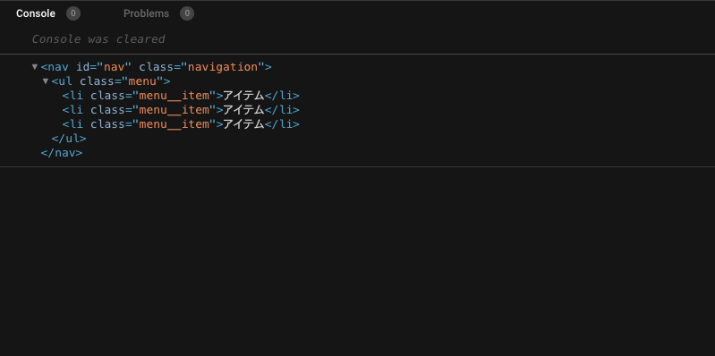
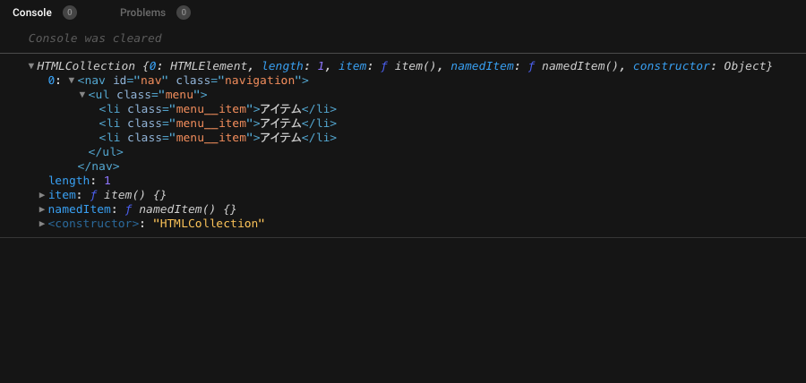

JavaScriptでDOMの操作（たとえば、このタグに対してこのクラス名をつけたい...など）をしたいとき、まず必要となるのが要素の取得です。

[[do | 今回やること]]
| id・class属性をもつ要素を取得する。

---

## 実際にみていきます

### こんなHTMLがあるものとします

```html:title=index.html
<nav id="nav" class="navigation">
    <ul class="menu">
        <li class="menu__item">アイテム</li>
        <li class="menu__item">アイテム</li>
        <li class="menu__item">アイテム</li>
    </ul>
</nav>
```

### id属性の指定で取得してみる

```javascript:title=index.js
const navItem = document.getElementById("nav");

console.log(navItem);//コンソール画面用
```



👆 ```console.log();``` をつかってデベロッパーツールをみてみると、__nav__ というidがついた要素が取得されています。

[[tech | データの取得]]
| ```getElementById()``` メソッドでid属性をもつ要素を取得することができます。

```document``` は ```<head>``` や ```<body>``` などの多数の要素から成るDOMツリーをイメージしておいていいかと思います。```console.log(document)``` または、```console.log(window.document)``` で中身をみてみるとわかりやすいです。

### class属性の指定で取得してみる

```javascript:title=index.js
const navItem = document.getElementsByClassName("navigation");

console.log(navItem);//コンソール画面用
```



ごちゃごちゃしたのが返ってきました...

[[tech | データの取得]]
| ```getElementsByClassName()``` メソッドでclass属性をもつ要素を取得することができます。

[[note | NOTE]]
| ```getElementsByClassName()``` は ```getElementById()``` と返り値が違い、__HTMLCollection__ という __配列風のオブジェクト__ であらわされます。


[[note | NOTE]]
| 要素の横にふられている番号はインデックス番号です。```getElementsByClassName()``` をつかって要素を取得する場合は、```getElementsByClassName()[0]``` のように __[]__ にインデックス番号をいれてアクセスします。

### セレクターの指定で取得してみる

```javascript:title=index.js
const navItem = document.querySelector(".navigation");

console.log(navItem);//コンソール画面用
```


👆 ```getElementById()``` をつかって取得したときと同じ返り値で表示されました。

[[tech | データの取得]]
| ```querySelector()``` メソッドで、指定した属性をもつ要素を取得することができます。

id名で取得したい場合は、```document.querySelector("#〇〇")``` とします。

[[note | NOTE]]
| 一つの要素を取得したいときは ***querySelector*** 、複数の要素を取得したいときは ***querySelectorAll*** を使います。

以上です、おつかれさまでした👏👏👏

JavaScript で要素を取得する方法はいくつかありますが、個人的にはセレクターを指定して取得するのが多いかなと思います。必ずといっていいほど使用するコードなので、ぜひ覚えておきたいですね！